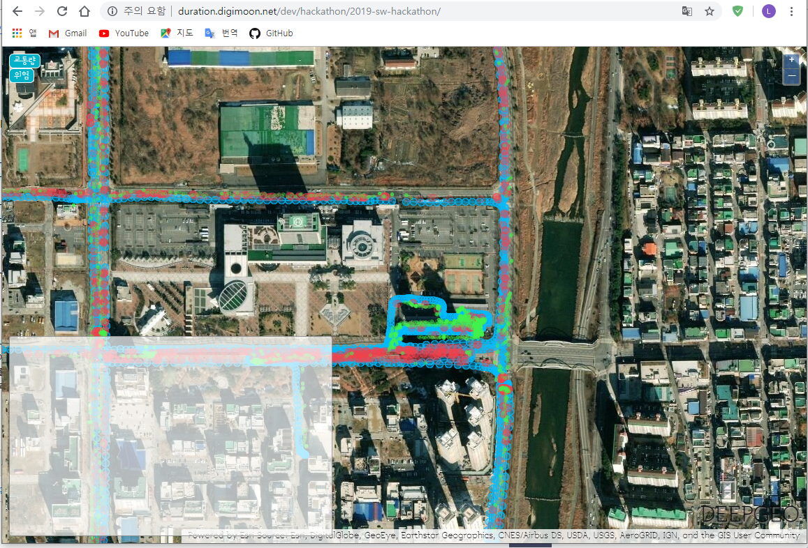

# 2019 KOREA SW HACKATHON

2019년 제 6회 대한민국 SW융합 해커톤 대회 DEV팀

## Team

- DEV
  - Leader : [`김영지`](https://github.com/Yeong-o)
  - Member : [`류동준`](https://github.com/rdj94), [`이동건`](https://github.com/Sotaneum), `김명석`

## Project

- Road Damage Detection : `도로상의 포트홀`을 사람이 직접 찾아다니던 기존의 방식을 `블랙박스 영상`을 분석(딥러닝)하여 `자동으로 감지`하게 해 `인적/시간적` 비용을 획기적으로 줄일 수 있는 아이디어
- 사용 언어 : HTML, CSS, javascript, [jQuery](https://jquery.com/), [Openlayers](https://openlayers.org/), jsDrawViewer, [jsTree](https://www.jstree.com/), Ajax
  - 데이터 가공 : Python(with [Mask R-CNN](https://github.com/matterport/Mask_RCNN), [Yolo](https://pjreddie.com/darknet/yolo/), [OpenCV](https://opencv.org/))
- [Preview](http://duration.digimoon.net/dev/hackathon/2019-sw-hackathon/)
  - 주의 : 동영상의 용량이 커 업로드 하지 않았습니다.

## Role

- 프론트 엔드
  - HTML, CSS, javascript, [jQuery](https://jquery.com/), [Openlayers](https://openlayers.org/), jsDrawViewer, [jsTree](https://www.jstree.com/), Ajax
  - 프로젝트에서 웹으로 데이터를 보여주는 시각화 부분을 담당했습니다.
  - GeoJSON 형태의 포맷인 json 파일들을 파싱해 화면에 표시합니다.
  - 토글 키로 원하는 데이터를 보여줄 수 있도록 하였습니다.
- jsDrawViewer
  - `김영지 팀장`과 함께 작업했습니다.
  - 영상이나 이미지를 재생하거나 보여주는 레이어입니다.
  - Annotation JSON 형태의 값을 입력하면 영상, 이미지에 각각 다음과 같이 보여줍니다.
    - 이미지
      - 이미지 위에 해당 폴리곤 데이터를 그려줍니다.
    - 동영상
      - annotation JSON의 id값을 기준으로 1ms 단위로 화면에 폴리곤 데이터를 보여줍니다.

## What did you learn

- Javascript에서도 충분히 데이터마이닝 처리가 가능하다는 것을 알게 되었습니다.
- Openlayers의 마커 데이터를 숨겼다가 보여졌다가 하는 방식을 알게 되었습니다.
- Javascript 형태의 라이브러리 구현 방식에 대해 알게 되었습니다.
- 여러 사람과 함께하는 프로젝트가 재미있다는 것을 알게 되었습니다.

## Modify Content

- 2019-09-01
  - 해커톤 종료 및 내용 정리

## Copyright

- 서체 저작권
  - [㈜디자인하우스](designhouse.co.kr/service/dhfont)
- 비상업적 용도로 사용 가능하며 링크를 반드시 포함해주세요.
- 문제가 되는 내용이 있다면 언제든지 [`issue`](https://github.com/Sotaneum/2019-KOREA-SW-HACKATHON/issues/new), [`Pull requests`](https://github.com/Sotaneum/2019-KOREA-SW-HACKATHON/compare) 부탁드립니다.
